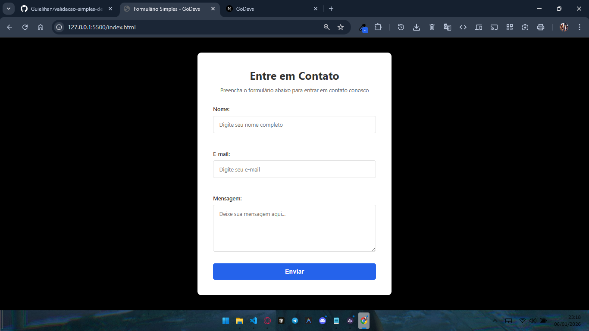

<<<<<<< HEAD
# Validação Simples de Formulário

Um projeto de validação de formulário simples e funcional com HTML, CSS e JavaScript.



## 🎯 Requisitos Implementados

✅ **Interceptação do evento submit** - O formulário intercepta o evento de envio e valida antes de prosseguir.

✅ **Validação de campos vazios** - Verifica se os campos de nome e e-mail não estão vazios.

✅ **Mensagens de erro visuais** - Exibe mensagens de erro descritivas em vermelho quando há problemas.

✅ **Prevenção de envio inválido** - Impede o envio do formulário se houver campos vazios ou inválidos.

## 📋 Funcionalidades

- **Validação de Nome:**
  - Verifica se o campo não está vazio
  - Valida o comprimento mínimo (3 caracteres)
  - Exibe mensagem de erro específica

- **Validação de E-mail:**
  - Verifica se o campo não está vazio
  - Valida o formato de e-mail com regex
  - Exibe mensagem de erro específica

- **Feedback em Tempo Real:**
  - As validações ocorrem enquanto o usuário digita
  - Feedback visual com campos destacados em vermelho

- **Mensagem de Sucesso:**
  - Exibe confirmação quando o formulário é enviado com sucesso
  - Desaparece automaticamente após 3 segundos

## 🚀 Como Usar

1. Abra o arquivo `index.html` em seu navegador
2. Preencha o formulário com seus dados
3. O sistema validará automaticamente enquanto você digita
4. Se todos os campos estiverem válidos, clique em "Enviar"

## 📁 Estrutura de Arquivos

```
├── index.html      # Estrutura do HTML com o formulário
├── style.css       # Estilos visuais e animações
├── script.js       # Lógica de validação
└── README.md       # Este arquivo
```

## 🎨 Design

- Interface moderna com fundo preto (#000000)
- Modal branco e limpo com sombra suave
- Responsive design (funciona em dispositivos móveis)
- Animações suaves para melhor experiência do usuário
- Cores visuais claras para feedback (vermelho para erro, verde para sucesso)
- Botão com cor sólida (#2563EB) para melhor contraste
- Textarea redimensionável apenas na vertical para manter a largura do formulário

## 💡 Detalhes Técnicos

- **Validação Frontend:** Realizada completamente no navegador com JavaScript
- **Prevenção Padrão:** Usa `event.preventDefault()` para impedir envios inválidos
- **Manipulação do DOM:** Adiciona/remove classes e atualiza mensagens dinamicamente
- **Regex:** Padrão para validação de e-mail: `/^[^\s@]+@[^\s@]+\.[^\s@]+$/`

## 📝 Notas

- Este é um exemplo de validação frontend. Em produção, sempre valide também no backend!
- O formulário simula o envio (não envia para um servidor real)
- Os dados são logados no console do navegador para referência

---

**Desenvolvido como exemplo de validação simples de formulários.**

## 📞 Contato & Links

- **Discord:** [guielihan](https://discord.com/users/1297971679737413632)
- **Email:** devguielihan@gmail.com
- **Professor:** [Luan - GitHub](https://github.com/in100tiva)
- **Plataforma:** [GoDevs - Plataforma de ensino de programação](https://godevs.in100tiva.com/)